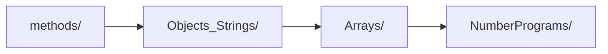
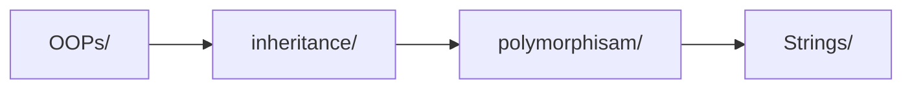
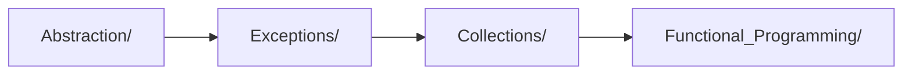

<div align="center">

# 🚀 Java Practice Repository

[](https://www.oracle.com/java/)
[](https://github.com)
[](LICENSE)

**A comprehensive collection of 300+ Java programs covering fundamental to advanced concepts**

[📚 Getting Started](#-getting-started) • [🎯 Learning Path](#-learning-path) • [📁 Structure](#-repository-structure) • [🤝 Contributing](#-contributing)

</div>

---

## 📊 Repository Stats

<div align="center">

| 📁 **Folders** | 📄 **Programs** | 🎯 **Topics** | 📈 **Difficulty** |
|:-------------:|:---------------:|:-------------:|:-----------------:|
| 18+ | 300+ | 15+ | Beginner → Advanced |

</div>

## 🗂️ Repository Structure

<details>
<summary><b>📁 Click to expand folder structure</b></summary>

```
📦 prac/
├── 📄 README.md
├── 📁 Abstraction/           # Abstract classes & interfaces
├── 📁 Anonymous/             # Anonymous inner classes
├── 📁 Arrays/                # Array operations & algorithms
├── 📁 Basic_Programs/        # Real-world application programs
├── 📁 Collections/           # Java Collections Framework
├── 📁 Conditional_Statements/ # If-else, switch, type casting
├── 📁 Exceptions/            # Exception handling scenarios
├── 📁 File_handling/         # File I/O operations
├── 📁 Functional_Programming/ # Lambda & Stream API
├── 📁 inheritance/           # Inheritance concepts
├── 📁 Loops/                 # For, while, do-while loops
├── 📁 methods/               # Method implementations
├── 📁 NumberPrograms/        # Mathematical algorithms
├── 📁 Objects_Strings/       # Object & String basics
├── 📁 OOP_Concepts/          # Advanced OOP
├── 📁 OOPs/                  # OOP principles
├── 📁 polymorphism/         # Polymorphism examples
├── 📁 Relations_In_java/     # Object relationships
├── 📁 Strings/               # String manipulation (46 programs)
└── 📁 Wrapper/               # Wrapper classes
```

</details>

## 📚 Topics Overview

<div align="center">

| 🏷️ **Category** | 📁 **Folder** | 📊 **Programs** | 🎯 **Focus Area** |
|:---------------:|:-------------:|:---------------:|:-----------------:|
| 🔤 **Strings** | [`Strings/`](Strings/) | 46 | String manipulation & algorithms |
| 🗃️ **Arrays** | [`Arrays/`](Arrays/) | 40+ | Array operations & sorting |
| 🏢 **Basic Programs** | [`Basic_Programs/`](Basic_Programs/) | 25+ | Real-world applications |
| ⚠️ **Exceptions** | [`Exceptions/`](Exceptions/) | 22+ | Error handling & custom exceptions |
| 🏗️ **Inheritance** | [`inheritance/`](inheritance/) | 25+ | OOP inheritance concepts |
| 🔧 **Methods** | [`methods/`](methods/) | 20+ | Method implementations |
| 📊 **NumberPrograms** | [`NumberPrograms/`](NumberPrograms/) | 16+ | Mathematical algorithms |
| 📦 **Collections** | [`Collections/`](Collections/) | 15+ | Java Collections Framework |
| 🎭 **Abstraction** | [`Abstraction/`](Abstraction/) | 12+ | Abstract classes & interfaces |
| 🧮 **OOP** | [`OOPs/`](OOPs/) | 12+ | Object-oriented principles |
| 🔁 **Loops** | [`Loops/`](Loops/) | 10+ | For, while, do-while loops |
| 🎯 **Functional** | [`Functional_Programming/`](Functional_Programming/) | 8+ | Lambda & Stream API |
| 📝 **Objects_Strings** | [`Objects_Strings/`](Objects_Strings/) | 8+ | Object & String basics |
| 🔀 **Conditional** | [`Conditional_Statements/`](Conditional_Statements/) | 3+ | If-else, switch, casting |
| 📁 **File I/O** | [`File_handling/`](File_handling/) | 5+ | File operations |
| 🎪 **Others** | Various | 30+ | Polymorphism, Relations, etc. |

</div>

## 🚀 Getting Started

<details>
<summary><b>🔧 Prerequisites</b></summary>

- ☕ **Java Development Kit (JDK)** 8 or higher
- 🛠️ **IDE**: Eclipse, IntelliJ IDEA, or VS Code
- 📚 **Basic understanding** of Java syntax

</details>

<details>
<summary><b>▶️ Running Programs</b></summary>

### Simple Programs
```bash
# Navigate to any folder
cd Arrays/

# Compile
javac FindLargest.java

# Run
java FindLargest
```

### Package-based Programs
```bash
# From root directory
javac Abstraction/ABasic.java
java Abstraction.ABasic
```

</details>

## 🎯 Learning Path

<div align="center">

### 🌱 **Beginner Level**


### 🌿 **Intermediate Level**


### 🌳 **Advanced Level**


</div>

<details>
<summary><b>📋 Detailed Learning Roadmap</b></summary>

| 🎚️ **Level** | 📁 **Topics** | ⏱️ **Duration** | 🎯 **Goals** |
|:------------:|:-------------:|:---------------:|:------------:|
| **Beginner** | Methods, Objects, Arrays, Numbers | 2-3 weeks | Master Java basics |
| **Intermediate** | OOP, Inheritance, Polymorphism, Strings | 3-4 weeks | Understand OOP concepts |
| **Advanced** | Abstraction, Exceptions, Collections, Functional | 4-5 weeks | Professional Java skills |

</details>

## ✨ Key Features

<div align="center">

| 🎯 **Feature** | 📝 **Description** |
|:--------------:|:------------------:|
| 👶 **Beginner-friendly** | Clear comments and simple logic |
| 🌍 **Real-world examples** | Practical scenarios and applications |
| 📈 **Progressive difficulty** | From basic to advanced concepts |
| 📚 **Complete coverage** | All Java fundamentals included |
| ✅ **Best practices** | Industry-standard implementations |
| 📖 **Well-documented** | Comprehensive README files |

</div>

## 📝 Code Style

- Clear variable names
- Minimal but effective implementations
- Proper indentation and formatting
- Meaningful method names
- Comprehensive examples

## 🤝 Contributing

<div align="center">

**We welcome contributions! Here's how you can help:**

[](http://makeapullrequest.com)

</div>

<details>
<summary><b>🔧 How to Contribute</b></summary>

1. **🍴 Fork** the repository
2. **🌿 Create** a feature branch (`git checkout -b feature/AmazingFeature`)
3. **💾 Commit** your changes (`git commit -m 'Add some AmazingFeature'`)
4. **📤 Push** to the branch (`git push origin feature/AmazingFeature`)
5. **🔄 Open** a Pull Request

### 📝 Contribution Guidelines
- ✅ Add new programs with clear documentation
- ✅ Follow existing code style and naming conventions
- ✅ Include comments explaining complex logic
- ✅ Update README files when adding new folders
- ✅ Test your code before submitting

</details>

## 📞 Support & Contact

<div align="center">

**Need help or have questions?**

[](../../issues)
[](../../discussions)

📧 **Email**: moondkrish921@gmail.com

</div>

---

<div align="center">

## 🌟 Show Your Support

**If this repository helped you learn Java, please consider:**

⭐ **Star this repository**  
🍴 **Fork for your own learning**  
📢 **Share with fellow developers**  

[](../../stargazers)
[](../../network/members)

**Happy Coding! 🎉**

*Made with ❤️ for the Java community*

</div>